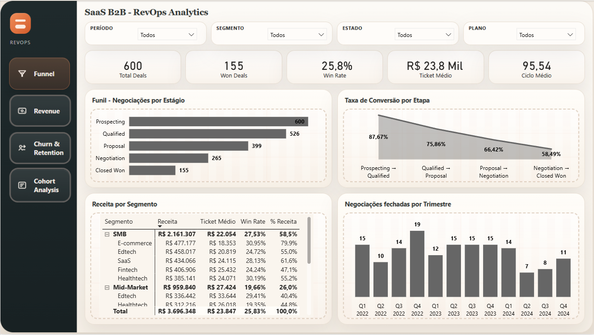
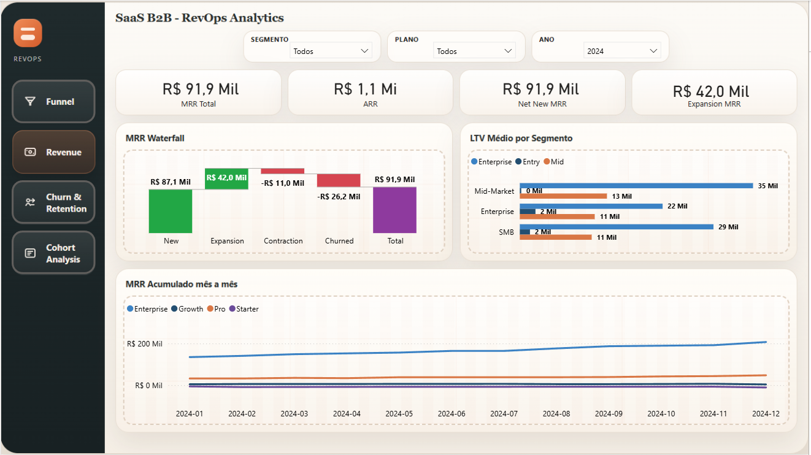
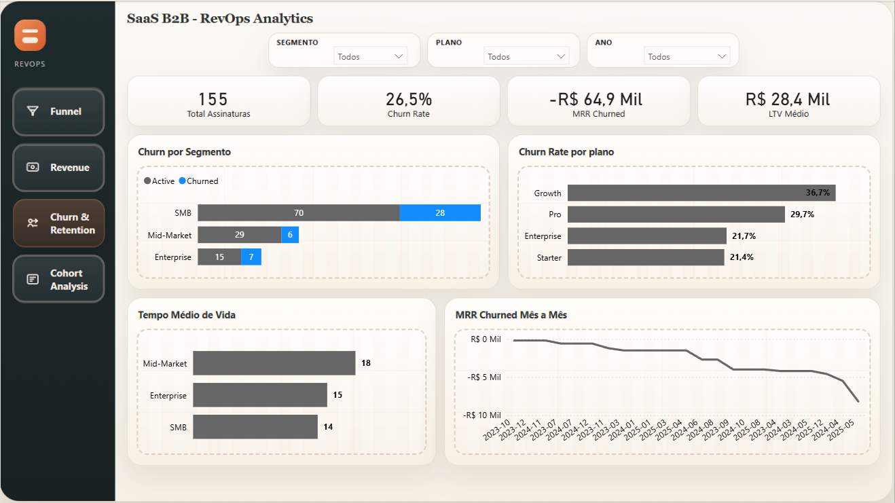
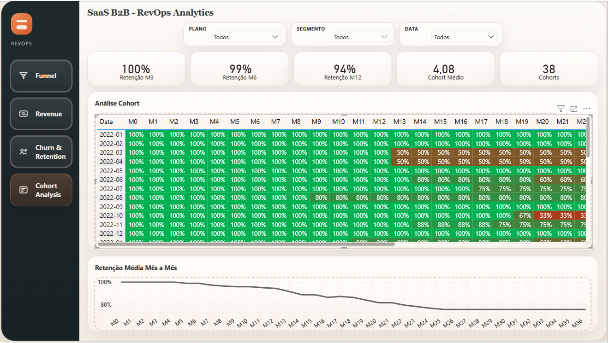
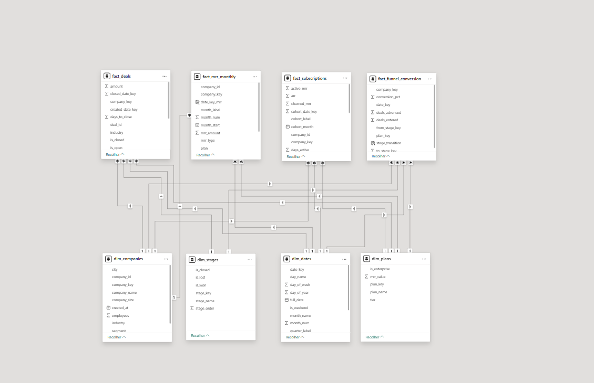
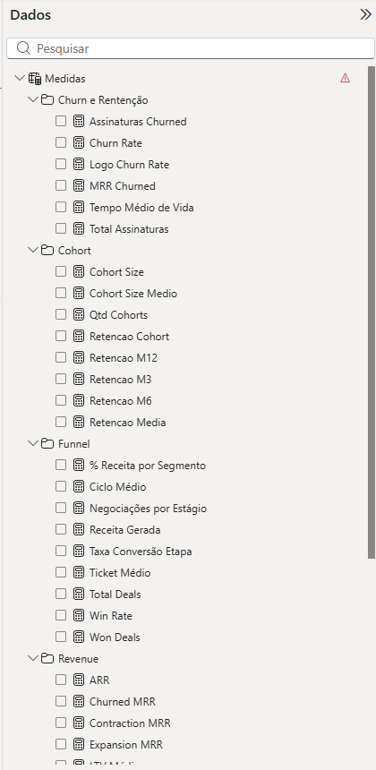

# RevOps Analytics Pipeline

[🇧🇷 Português](README.md) | [🇺🇸 English](README.en.md)


End-to-end data project for a fictional B2B SaaS company, covering data generation, BigQuery ingestion, analytical modeling with dbt, orchestration with Airflow, and consumption in Power BI.

The goal of this repository is to simulate a data flow close to a real corporate Revenue Operations scenario, focusing on sales funnel performance, recurring revenue, churn, retention, and cohort analysis.

## Summary

1. [Overview](#overview)
2. [Architecture](#architecture)
3. [Business Context](#business-context)
4. [Tech Stack](#tech-stack)
5. [Repository Structure](#repository-structure)
6. [Generated Data](#generated-data)
7. [Orchestrated Pipeline](#orchestrated-pipeline)
8. [Analytical Layers in dbt](#analytical-layers-in-dbt)
9. [Data Quality](#data-quality)
10. [Power BI](#power-bi)
11. [Results](#results)
12. [How to Run](#how-to-run)
13. [Learnings and Next Steps](#learnings-and-next-steps)

## Overview

The pipeline was built to answer typical RevOps questions:

- How many deals entered and advanced through each funnel stage
- What is the win rate by segment, plan, and period
- What are active MRR, ARR, churned MRR, expansion, and contraction
- How customer retention evolves over time
- Which cohorts retain better and when they begin to deteriorate

The project removes parallel analytical steps outside the main stack. The final layer consumed by Power BI comes directly from BigQuery.

## Architecture

```text
Python synthetic source
        |
generate_data.py
        |
load_to_bigquery.py
        |
BigQuery raw (revops_raw)
        |
dbt run
        |
dbt test
        |
BigQuery analytics (revops)
        |
Power BI
```

Daily execution in Airflow:

```text
generate_raw_data
    -> load_raw_to_bigquery
    -> dbt_run_bigquery
    -> dbt_test_bigquery
```

## Business Context

The fictional company operates under a B2B SaaS model, selling four plans:

- Starter
- Growth
- Pro
- Enterprise

The data simulates the full acquisition and retention lifecycle:

- companies
- contacts
- deals
- stage history
- sales activities
- subscriptions
- plan changes

This makes it possible to build an integrated view across sales pipeline, conversion, active customer base, recurring revenue, and churn.

## Tech Stack

- Python 3.12
- Pandas
- Faker
- Google BigQuery
- dbt Core 1.11
- Apache Airflow 3
- Docker Compose
- Power BI

## Repository Structure

```text
revops-analytics-pipeline/
+-- airflow/
|   +-- dags/
|   |   +-- revops_pipeline_dag.py
|   +-- docker-compose.yml
|   +-- Dockerfile
|   +-- requirements.txt
+-- credentials/
+-- data/
|   +-- raw/
+-- logs/
+-- powerbi/
|   +-- powerbi_bigquery_setup.md
+-- revops_dbt/
|   +-- models/
|   |   +-- staging/
|   |   +-- marts/
|   +-- profiles/
|   +-- tests/
|   +-- dbt_project.yml
|   +-- target/
+-- explore_data.py
+-- generate_data.py
+-- load_to_bigquery.py
+-- requirements.txt
+-- README.md
```

## Generated Data

The data is synthetic, but it follows business rules consistent with a SaaS scenario.

### Current data volume

- 300 companies
- 1,041 contacts
- 600 deals
- 155 subscriptions
- 38 plan changes
- 3,497 activities
- 2,030 stage history events

### Time window

- deals generated between 2022-01-01 and 2024-12-31
- subscriptions started between 2022-01-22 and 2025-05-21
- 38 monthly cohorts identifiable in the dataset

### Implemented generation rules

- segment distribution weighted toward SMB
- plans with fixed MRR by tier
- sales stages with probabilistic distribution
- subscriptions created only from Closed Won deals
- churn applied to part of the base with variable duration
- plan changes only over active subscriptions
- upgrades more frequent than downgrades
- stage progression history across the funnel
- sales activities linked to deals and contacts

## Orchestrated Pipeline

The main DAG is in [airflow/dags/revops_pipeline_dag.py](/c:/Users/Felipe/revops-analytics-pipeline/airflow/dags/revops_pipeline_dag.py).

Implemented characteristics:

- daily execution at 06:00 UTC
- `catchup=False`
- `max_active_runs=1`
- `retries=2`
- `retry_delay=5 minutes`
- Python and dbt execution inside the Airflow stack

### Task order

1. `generate_raw_data`
2. `load_raw_to_bigquery`
3. `dbt_run_bigquery`
4. `dbt_test_bigquery`

### Airflow infrastructure

The local stack uses:

- `postgres`
- `airflow-init`
- `airflow-api-server`
- `airflow-scheduler`
- `airflow-dag-processor`

The environment was adjusted to the Airflow 3 standard, including `api-server` and `dag-processor`.

## Analytical Layers in dbt

The dbt project is in [revops_dbt](/c:/Users/Felipe/revops-analytics-pipeline/revops_dbt).

### Sources

Sources are read from the `revops_raw` dataset:

- `companies`
- `contacts`
- `deals`
- `subscriptions`
- `plan_changes`
- `activities`
- `stage_history`

### Staging

Standardization models:

- `stg_companies`
- `stg_contacts`
- `stg_deals`
- `stg_subscriptions`
- `stg_plan_changes`
- `stg_activities`
- `stg_stage_history`

These models handle types, field names, and analytical flags such as `is_closed`, `is_won`, and `is_churned`.

### Dimensions

Published dimensions:

- `dim_companies`
- `dim_plans`
- `dim_stages`
- `dim_dates`

Examples of enrichment:

- company size classification into `Micro`, `Small`, `Medium`, and `Large`
- plan tiering and `is_enterprise` flag
- calendar with `date_key`, `year_month`, quarter, weekday, and helper attributes

### Facts

Modeled facts:

- `fact_deals`
- `fact_subscriptions`
- `fact_mrr_monthly`
- `fact_funnel_conversion`

These tables support a semantic model closer to a corporate BI environment.

### Analytical marts

Fast-consumption tables:

- `mart_funnel`
- `mart_churn`
- `mart_mrr`
- `mart_funnel_conversion`

These marts accelerate dashboard prototyping and exploratory analysis.

## Data Quality

The project includes automated validation at multiple layers:

- `not_null`
- `unique`
- `relationships`
- `accepted_values`
- custom business-rule tests

Examples of custom rules:

- active subscriptions must not have `end_date`
- churned subscriptions must have `end_date`
- closed deals must have `closed_at`
- `won_amount` must correctly reflect the won flag

### Validated result

In a full pipeline run:

- `dbt run`: `PASS=19`
- `dbt test`: `PASS=138`
- `WARN=0`
- `ERROR=0`

Generated dbt artifacts indicate:

- 19 models
- 138 tests
- 7 sources

## Power BI

Analytical consumption was designed to happen directly on top of the `revops` dataset in BigQuery.

Technical setup and modeling guide:

- [powerbi/powerbi_bigquery_setup.md](/c:/Users/Felipe/revops-analytics-pipeline/powerbi/powerbi_bigquery_setup.md)

### Planned analytical structure in the dashboard

The dashboard was organized around four main fronts:

- Funnel
- Revenue
- Churn / Retention
- Cohort Analysis

### Recommended semantic model

Recommended Power BI tables:

- `fact_deals`
- `fact_subscriptions`
- `fact_mrr_monthly`
- `fact_funnel_conversion`
- `dim_companies`
- `dim_plans`
- `dim_stages`
- `dim_dates`

### Note on cohort analysis

For cohort analysis in Power BI, the most stable approach was:

- rows by `cohort_label`
- columns by relative month (`M0`, `M1`, `M2`...)
- disconnected offset table for retention

This design avoids conflict between acquisition month and retention month when the fact uses `start_date_key` as the main date relationship.

## Dashboard Screenshots

### Funnel



### Revenue



### Churn & Retention



### Cohort Analysis



### Semantic Model



### DAX Measures



## Results

### Engineering

- data generation working locally and through Airflow
- raw load working in BigQuery with `WRITE_TRUNCATE`
- dbt running inside the orchestrated environment
- quality tests running in the same DAG flow
- final analytical layer published in the `revops` dataset

### Portrait of the fictional company

#### Sales pipeline

- 600 deals in total
- 155 `Closed Won`
- 85 `Closed Lost`
- 360 deals still open
- overall win rate over total deals: `25.83%`
- win rate over closed deals: `64.58%`
- overall average ticket: `21,063.42`
- average ticket of won deals: `23,847.41`
- average sales cycle for closed deals: `94.92 days`

#### Revenue and active base

- 155 subscriptions generated from won deals
- 114 active subscriptions
- 41 churned subscriptions
- subscription churn rate: `26.45%`
- total historical MRR in the base: `265,745`
- current active MRR: `200,886`
- current estimated ARR: `2,410,632`
- cumulative churned MRR in the base: `64,859`

#### Plan mix

- Enterprise: 46 subscriptions
- Starter: 42 subscriptions
- Pro: 37 subscriptions
- Growth: 30 subscriptions

In the active base, the Enterprise plan concentrates `71.66%` of current MRR, showing high dependence on larger-ticket accounts.

#### Plan changes

- 38 plan changes
- 30 upgrades
- 8 downgrades
- `78.95%` of changes are upgrades
- net MRR delta in plan changes: `+33,800`

This behavior suggests an operation with good expansion potential within the base, despite churn pressure on part of the customer set.

## How to Run

### 1. Prerequisites

- Python 3.12
- Docker Desktop
- access to a GCP project with BigQuery enabled
- service account credentials with read and write permissions on the datasets

### 2. Clone the repository

```bash
git clone https://github.com/joaoferro710/revops-analytics-pipeline.git
cd revops-analytics-pipeline
```

### 3. Create the local virtual environment

```bash
py -3.12 -m venv .venv
.venv\Scripts\activate
pip install -r requirements.txt
```

### 4. Generate local data

```bash
py generate_data.py
```

Generated files in `data/raw/`:

- `companies.csv`
- `contacts.csv`
- `deals.csv`
- `subscriptions.csv`
- `plan_changes.csv`
- `activities.csv`
- `stage_history.csv`

### 5. Configure credentials and variables

Relevant variables:

- `GCP_PROJECT_ID`
- `BQ_RAW_DATASET_ID`
- `BQ_ANALYTICS_DATASET_ID`
- `BQ_LOCATION`
- `GOOGLE_APPLICATION_CREDENTIALS`
- `DBT_PROFILES_DIR`

The `credentials/` directory is local and should remain out of version control.

### 6. Load data into BigQuery

```bash
py load_to_bigquery.py
```

The script:

- ensures the raw dataset exists
- reads CSV files from `data/raw`
- loads each table with `WRITE_TRUNCATE`

### 7. Run dbt locally

```bash
cd revops_dbt
dbt run --target bigquery --profiles-dir profiles
dbt test --target bigquery --profiles-dir profiles
```

### 8. Start local Airflow

```bash
cd airflow
copy .env.example .env
docker compose up -d
```

After that:

- Airflow available at `http://localhost:8080`
- main DAG: `revops_analytics_daily`
- default local authentication: `admin / admin`

### 9. Connect Power BI

1. Open Power BI Desktop
2. Select `Get data`
3. Connect to `Google BigQuery`
4. Navigate to `revops-analytics-personal > revops`
5. Import the recommended facts and dimensions
6. Create the relationships described in `powerbi/powerbi_bigquery_setup.md`

## Learnings and Next Steps

This project consolidated a strong foundation in:

- analytical modeling for RevOps
- integration between orchestration, transformation, and BI
- fact and dimension design for semantic consumption
- quality tests inside the data delivery flow

Natural next evolutions for a future iteration:

- publish dashboard screenshots in the repository
- add CI for automatic dbt validation
- separate credentials and sensitive settings by environment
- include monitoring and operational alerts
- expand the model to NRR, GRR, and forecasting
